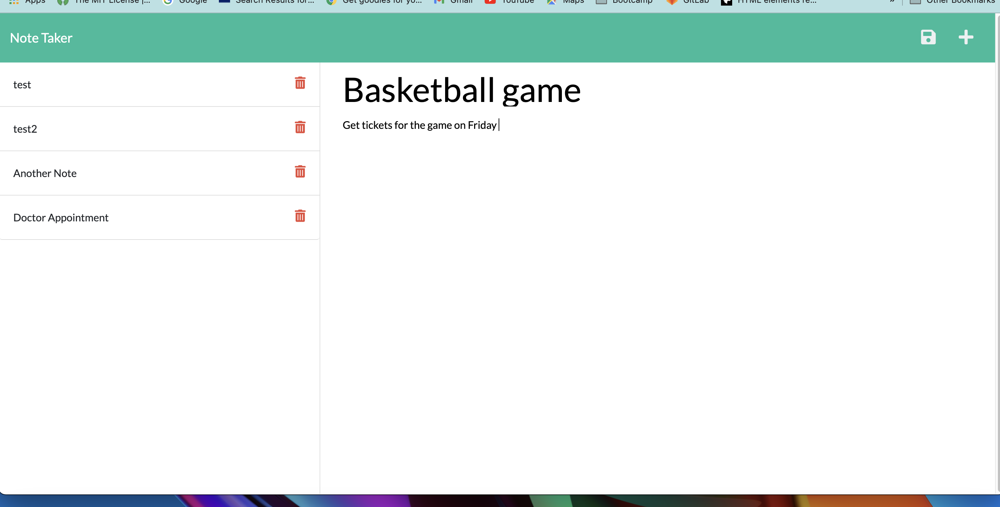
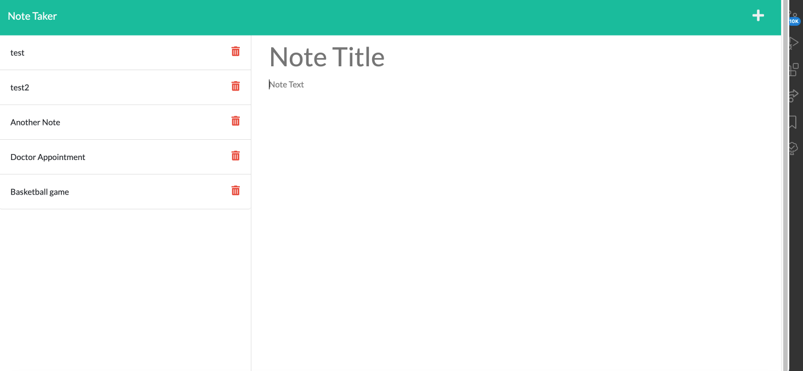

# __Note-taker-expressjs__

## __Description__

This application is an assignment to modify starter code and create a note-taker to be used to write and save notes with Express.js and retrieve note data from a JSON file.

---

### __How To Use:__
The user can open the app by clicking on [this link to the deployed application on Heroku](https://expressjs-notes.herokuapp.com/), and see a landing page and links to a note page, click on the `+` sign in the upper right corner of the landing age to create a new note and save the new note by clicking on the `save` icon in the upper right corner.

Users can also delete notes by clicking on the `red trashcan` icon located on the left side of the `Notes` page beside each individual note.

---

---

---
### __Technology__

- HTML/CSS
- Javascript
- Node.js
- NPM
- Express.js
- Heroku

  
  

---
[Deployed App in Heroku](https://expressjs-notes.herokuapp.com/)

[GitHub project repository](https://github.com/cheribc/Note-taker-expressjs)

---

### __Author__

[Cheribc](https://github.com/cheribc/Note-taker-expressjs)

---

#### __License__

[MIT](https://opensource.org/licenses/MIT)
